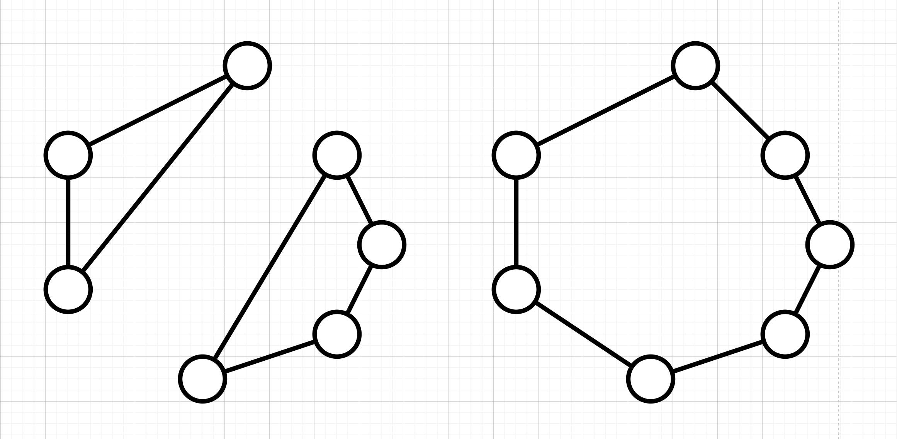

在读研一的时候第一次接触到子回路消除这个概念，今天特意写一下相关的内容，也算是一个心得与总结，以及一些我对于子回路消除的认知与理解。
本文将从一个简单的TSP问题开始讲起，提出模型与消除方法，并使用求解器Gurobi实现各种子回路消除方法。

# 什么是子回路？

子回路是一个在TSP中和VRP中常见的现象，体现为一辆车走了两个或多个闭环路径。
如果不知道VRP和TSP相关的问题与模型，建议补习相关内容。
比如下面这张图的TSP问题。正常情况下，一个TSP问题的可行解应该如右图所示，即一辆车遍历所有节点。
而左图中，很明显每个点被遍历了，但是竟然出现了两辆车。这显然不符合对于TSP问题的假设。
然而在这种情况下（左图），两个回路竟然在数学公式上使用了同一辆车。
这就是一个典型的子回路现象。

# 为什么出现子回路

简单来说，子回路的出现就是我们缺少一部分约束，导致没有完全地刻画问题中车辆的行为。
我们知道车辆路径问题（vehicle routing problem, VRP）是旅行商问题（traveling salesman problem, TSP）问题的一个更加困难的版本，
与其用一个VRP的例子作为教程，不如使用更为简单的TSP作为上手的开始。
因为TSP过于经典，就不再过多赘述。
简单来说就是如何以最短的距离不重复地走完地图上所有的城市并且回到出发点，其(不完整的)数学模型如下：

$$
\min \sum_{i\in N} \sum_{j\in N} c_{ij}x_{ij}  \tag{1}
$$

$$
\sum_{i\in N} x_{ij} = \sum_{i\in N} x_{ji} = 1, \forall j \in N \tag{2}
$$

$$
x_{ij} \in \{0,1\}, \forall i \in N, j\in N \tag{3}
$$

上述公式使用了常见的符号集合，$N$是节点集合，$c_{ij}$是弧长。公式(2)表示每个点的入度等于出度，即流平衡。
公式(3)是0-1决策变量。

我们观察上面的图的左侧子图，每个点的入度也确实等于出度。也就是说上述的模型是不完整的，我们没有消除子回路的约束。

# 消除子回路

如上所述，我们需要增加一些约束，这些约束帮助我们消除子回路。这些约束都相当精彩，在领悟其中的原理之后拍手叫绝。

## DFJ方法
Dantzig-Fulkerson-Johnson 简称 DFJ 方法是消除子回路的经典方法，公式如下：

$$
\sum_{i\in S} \sum_{j \notin S} x_{ij} \ge 1, \forall S \subset N, S \ne \emptyset 
$$

DFJ约束规定一个节点集合$N$的非空子集$S$，要求连接$S$外面的点和在$S$内部的点的弧的数量大于等于1。
换句话说，对于任意一个$N$的子集$S$，一定有一条弧离开$S$。
反之，如果存在一个子集$S$，没有一条弧能够离开$S$，那就说明$S$存在子回路。

## MTZ方法

Miller, Tucker, and Zemlin 简称 MTZ 方法也是消除子回路的经典方法，公式如下：

$$
t_i-t_j+1\leq n(1-x_{ij}), \forall i,j\in N,i\neq j
$$

$$
t_i \ge 0, \forall i\in N
$$

MTZ方法引入了一个新的变量，这个变量没有任何物理意义，可以理解为访问的顺序。
MTZ公式应该可以这样理解：
首先，如果两个点$i,j$之间存在一个弧$(i,j)$，那么两个点之间的

## GG方法

## GP方法

# 如何实现子回路消除？
## DFJ实现

## MTZ实现

# 效果对比